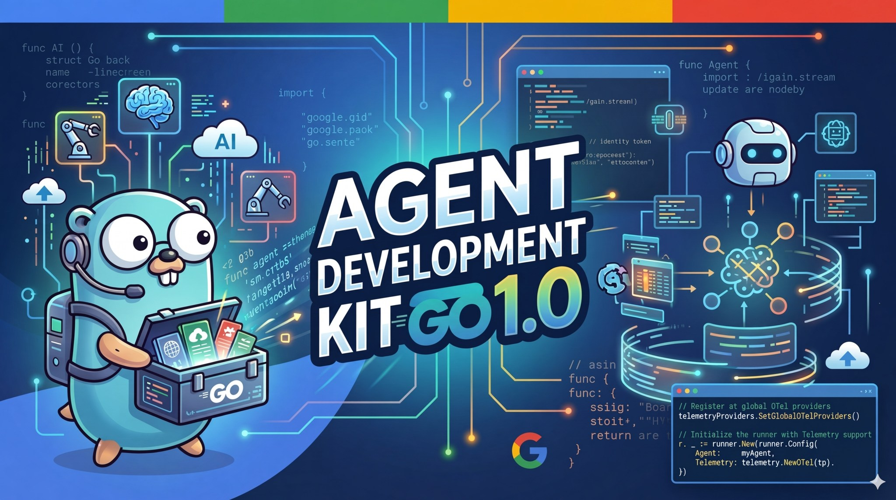

<div align="center">
  
</div>

# Google ADK Workshop

Hands-on materials for learning the [Google Agent Development Kit (ADK)](https://google.github.io/adk-docs/) in **Go**.

**What's included:**

- ✅ 17 progressive demo agents (beginner → expert)
- ✅ All ADK patterns: tools, sequential/loop/parallel workflows, state management, structured output
- ✅ Live HTTP API integration (NWS weather forecasts)
- ✅ Session memory and human-in-the-loop examples
- ✅ Security scanning (API key leak detection)
- ✅ Docker-ready HTTP server
- ✅ Full test suite (smoke tests + CI/CD)

**Official companion course:** [ADK Crash Course — From Beginner to Expert](https://codelabs.developers.google.com/onramp/instructions#0) (Google Codelabs).

## Prerequisites

- **Go 1.22+** ([install Go](https://golang.org/doc/install))
- A **Google AI Studio API key** ([get a key](https://ai.google.dev/gemini-api/docs/api-key)) **or** Vertex AI credentials (see [ADK authentication](https://google.github.io/adk-docs/))
- Optional: Google Cloud project if you use Vertex-only tools

## Quick Start

```bash
# 1. Clone and enter repository
git clone <repo> && cd google-adk-workshop

# 2. Set your API key
export GOOGLE_API_KEY="your-key-here"

# 3. Run a demo (picks one mode: console or web)
go run ./demos/01-hello_web console

# 4. Try another demo
go run ./demos/05-day_trip_search web  # Opens browser UI
```

## Setup (detailed)

From the repository root:

```bash
# 1. Verify Go is installed
go version    # Need Go 1.22+

# 2. Fetch dependencies
go mod tidy

# 3. Verify all demos build
go build ./...

# 4. Run all tests
go test ./...
```

### Environment variables

| Mode                           | Typical variables                                                                    | Notes                                                                                                 |
| ------------------------------ | ------------------------------------------------------------------------------------ | ----------------------------------------------------------------------------------------------------- |
| **Gemini API (Developer API)** | `export GOOGLE_API_KEY="your-key"`                                                   | Easiest for workshops; used by demos by default.                                                      |
| **Vertex AI**                  | `GOOGLE_CLOUD_PROJECT`, `GOOGLE_CLOUD_LOCATION`, and Application Default Credentials | Use when demos or your key policy require Vertex. See [ADK docs](https://google.github.io/adk-docs/). |

Optional: copy [`.env.example`](.env.example) to `workshop/.env` and fill in values. ADK Web loads per-agent `.env` when present. Never commit `.env`.

## Curriculum (beginner → advanced)

**For this Go version:** Start with the demo table above and progress from Beginner → Advanced → Expert. Each demo builds on previous concepts.

- Run a demo: `go run ./demos/XX-name [console|web]`
- Read the code: Open `demos/XX-name/main.go` to see patterns
- Review tests: `demos/XX-name/main_test.go` shows how to verify agent setup

**Additional resources (from original Python workshop):**

- Structured learning paths: [`CURRICULUM.md`](CURRICULUM.md) (Python-oriented, reference only)
- Unified day-long course: [`COURSE_BEGINNER_TO_EXPERT.md`](COURSE_BEGINNER_TO_EXPERT.md)
- Learning notebooks: [`ADK_Learning_tools.ipynb`](ADK_Learning_tools.ipynb), [`notebooks/`](notebooks/) (reference)
- Advanced topics: [`LEARNING_DEEP_DIVE.md`](LEARNING_DEEP_DIVE.md)
- Architecture & diagrams: [`ARCHITECTURE.md`](ARCHITECTURE.md)
- Deployment: [`DEPLOY.md`](DEPLOY.md)
- Integrations: [`INTEGRATIONS.md`](INTEGRATIONS.md)

## Runnable demos (`demos/`)

Each folder is one **ADK agent** (standalone Go program). All agents export a `main()` function and can be run via `go run`, and each has a `main_test.go` for verification. Set your API key first:

```bash
export GOOGLE_API_KEY="your-key-here"
```

Then run any demo:

```bash
# Console mode (chat in terminal)
go run ./demos/01-hello_web console

# Web UI mode (opens browser interface)
go run ./demos/05-day_trip_search web

# Or build and run
go build -o my-agent ./demos/01-hello_web
./my-agent console
```

Pick any demo from the table below — all work identically.

| Folder                                                                   | Level        | What it shows                  |
| ------------------------------------------------------------------------ | ------------ | ------------------------------ |
| [`01-hello_web`](demos/01-hello_web)                                     | Beginner     | Minimal agent                  |
| [`02-calculator_basics`](demos/02-calculator_basics)                     | Beginner     | Function tools (add, multiply) |
| [`03-custom_tools`](demos/03-custom_tools)                               | Beginner     | Custom tools (weather, time)   |
| [`04-static_kb_rag`](demos/04-static_kb_rag)                             | Intermediate | In-memory KB search            |
| [`05-day_trip_search`](demos/05-day_trip_search)                         | Intermediate | GoogleSearch grounding         |
| [`06-session_memory`](demos/06-session_memory)                           | Intermediate | Session state (StateDelta)     |
| [`07-sequential_pipeline`](demos/07-sequential_pipeline)                 | Intermediate | SequentialAgent workflow       |
| [`08-sequential_state_shared`](demos/08-sequential_state_shared)         | Intermediate | OutputKey + placeholders       |
| [`09-live_weather_nws`](demos/09-live_weather_nws)                       | Intermediate | Live HTTP API calls            |
| [`10-agent_config`](demos/10-agent_config)                               | Intermediate | Multiple tools (Go config)     |
| [`11-multi_agent_coordinator`](demos/11-multi_agent_coordinator)         | Advanced     | Sub-agents + coordinator       |
| [`12-agent_as_tool_orchestrator`](demos/12-agent_as_tool_orchestrator)   | Advanced     | agenttool pattern              |
| [`13-structured_output`](demos/13-structured_output)                     | Advanced     | JSON schema (genai.Schema)     |
| [`14-hitl_sensitive_action`](demos/14-hitl_sensitive_action)             | Advanced     | Human-in-the-loop              |
| [`15-structured_persona_research`](demos/15-structured_persona_research) | Expert       | Schema + agenttool             |
| [`16-loop_plan_refine`](demos/16-loop_plan_refine)                       | Expert       | LoopAgent refinement           |
| [`17-parallel_research_synth`](demos/17-parallel_research_synth)         | Expert       | ParallelAgent synthesis        |

**Note:** All demos can run via `go run ./demos/XX-name [console|web]`. `GoogleSearch` requires an eligible Gemini model and account; fallback demos: `01-hello_web`, `03-custom_tools`. See [`PRESENTER_GUIDE.md`](PRESENTER_GUIDE.md) for details.

## Verify demos locally

From the repository root:

```bash
# Set API key
export GOOGLE_API_KEY="your-key-here"

# Fetch dependencies
go mod tidy

# Compile all demos
go build ./...

# Run security scan (check for embedded API keys)
go run scripts/check_api_key_leaks.go

# Run all smoke tests
go test ./...
```

**CI:** [`.github/workflows/ci.yml`](.github/workflows/ci.yml) runs `go build`, the API key scan, and `go test` on push/PR.

## Learning diagrams

See [`ARCHITECTURE.md`](ARCHITECTURE.md) for Mermaid diagrams (agent/runner/session/tool flow).

## Presenter script

See [`PRESENTER_GUIDE.md`](PRESENTER_GUIDE.md) for timing, fallbacks, and links to [adk-docs](https://google.github.io/adk-docs/) and [adk-samples](https://github.com/google/adk-samples).

## Documentation & Resources

- **Full Conversion Summary:** See [`CONVERSION_SUMMARY.md`](CONVERSION_SUMMARY.md) for the complete Python-to-Go migration details
- **ADK Documentation:** [Agent Development Kit docs](https://google.github.io/adk-docs/)
- **Go ADK Library:** [google.golang.org/adk](https://pkg.go.dev/google.golang.org/adk)
- **ADK Samples:** [adk-samples](https://github.com/google/adk-samples)
- **ADK Crash Course:** [Google Codelabs](https://codelabs.developers.google.com/onramp/instructions#0)
- **Original Python Workshop:** See [`ADK_Learning_tools.ipynb`](ADK_Learning_tools.ipynb) and [`notebooks/`](notebooks/) for the predecessor version

## Reference

This Go version was developed as a complete rewrite of the original Python workshop, using Google’s official ADK resources including the [Agent Development Kit documentation](https://google.github.io/adk-docs/), the open-source [adk-go](https://github.com/google-adk-workshop/adk-go) library, the [ADK Crash Course codelab](https://codelabs.developers.google.com/onramp/instructions#0), and the original Python learning materials in this folder. It is not an official Google product.
